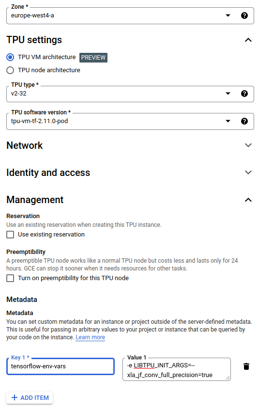
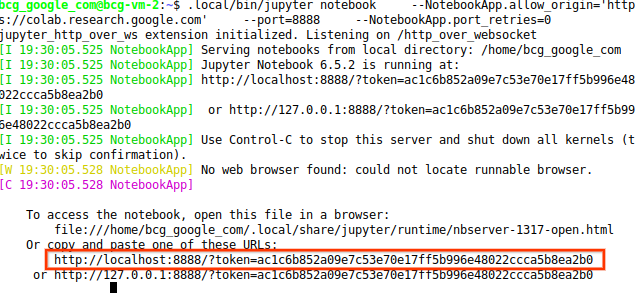
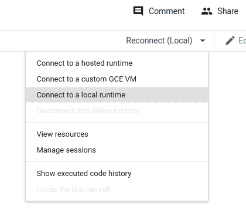
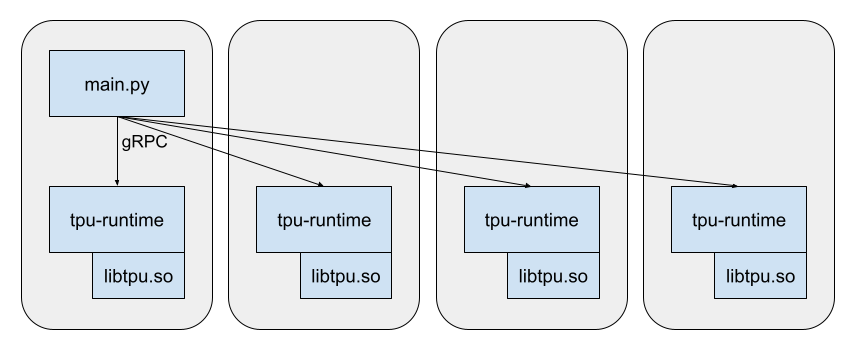

# Using Cloud TPUs


## Setting up Colab with a TPU Pod backend

Colab requires a backend (a.k.a., runtime) and a frontend. In this setup, we are
going to start a Jupyter backend on Cloud VMs with acesss to TPUs and use the
existing frontend colab.research.google.com.

The main challenge of the setup is to get colab.research.google.com to connect
to the Jupyter VM over the network. This is a challenge because of Cloud
security measures including these:

1.  colab.research.google.com doesn't connect to arbitrary machines.
1.  Jupyter by default allows only local connections.
1.  Cloud firewalls block all but a few ports by default.

Rather than undoing these measures, in this setup we are going to have Jupyter
listen on port 8888 and establish an ssh tunnel for 8888 all the way from the
machine running the browser to Jupyter.


1.  Using a machine where you have installed `gcloud`, create the TPU pod. The
    example below creates a pod of 4 TPUv3 hosts for a total of 32 TPUs.
    You can also use
    [the cloud console](https://console.cloud.google.com/compute/tpus) for this
    step and for figuring out what TPU topologies are available for your
    project.

    NOTE: The example below sets `--xla_jf_conv_full_precision` to true which
    forces TPU operations (convolutions and dot products) to use the highest
    float precision. To use low precision floats replace the `TPU_FLAGS` line
    below with `TPU_FLAGS=--xla_jf_conv_full_precision=false`.

    For an explanation of how TPU_FLAGS works see the section
    [Setting libtpu.so flags on pod TPUs.](#setting-libtpuso-flags-on-pod-tpus)

    ```shell
    PROJECT=<YOUR_PROJECT_ID>
    TPU=<A_UNIQUE_TPU_VM_NAME>
    ZONE=europe-west4-a
    TYPE=v3-32
    TPU_FLAGS=--xla_jf_conv_full_precision=true

    gcloud compute tpus tpu-vm create $TPU --project=$PROJECT --zone=$ZONE \
    --accelerator-type=$TYPE --version=tpu-vm-tf-2.12.0-pod \
    --metadata="tensorflow-env-vars=-e LIBTPU_INIT_ARGS=$TPU_FLAGS"
    ```

    Same example using the Cloud console:

    

1.  ssh to a VM in the pod and tunnel port 8888. By default this command
    connects to the first worker.

    ```shell
    gcloud alpha compute tpus tpu-vm ssh --zone=$ZONE --project=$PROJECT $TPU \
      -- -L 8888:localhost:8888
    ```

1.  In the worker VM, install and set up Jupyter along with a few common python
    packages.

    ```shell
    pip install jupyter jupyter_http_over_ws matplotlib scipy

    # This allows the colab frontend to talk to Jupyter.
    .local/bin/jupyter serverextension enable --py jupyter_http_over_ws

    # This stops the main process from seeing the local TPUs - we want the
    # local TPUs to be accessed as part of the pod.
    export TPU_LOAD_LIBRARY=0
    ```

1.  Start Jupyter.

    ```shell
    .local/bin/jupyter notebook \
    --NotebookApp.allow_origin='https://colab.research.google.com' \
    --port=8888 \
    --NotebookApp.port_retries=0
    ```

1.  When Jupyter starts it will print out a localhost URL with a security token.
    Copy this URL.

    

    Then use it to connect to a "local" runtime in colab.research.google.com.

    

1.  When you are done, delete the TPU pod. Unlike non-pod VMs, it is not
    possible to stop the VMs and later start them back again, so deleting is the
    only option. Run this command back on your workstation.

    ```shell
    gcloud compute tpus tpu-vm delete $TPU --zone=$ZONE --project=$PROJECT
    ```

## Configuring TPU libraries via flags

### libtpu.so

On Cloud, code that interacts with TPU hardware is linked into binaries as a
dynamically-loaded library, named *libtpu.so*.

One implication of loading *libtpu.so* dynamically is that flags that are
defined in *libtpu.so* are not available to the main process. The startup code
of the main process that deals with command line arguments is not aware of the
flags defined in *libtpu.so* and cannot initialize them.

TensorFlow has a workaround for this issue. The code that loads *libtpu.so* uses
the value of the environment variable LIBTPU_INIT_ARGS to initialize the flags
defined *libtpu.so*.


### Setting libtpu.so flags on non-pod TPUs

When you run a TensorFlow binary on non-pod TPUs (e.g., <=8 TPUv3 TPUs),
the main process loads *libtpu.so*, so you can set *libtpu.so* flags via the
environment variable LIBTPU_INIT_ARGS. For example, to run main.py and with the
flag `--xla_jf_conv_full_precision` set to true:

```shell
LIBTPU_INIT_ARGS=--xla_jf_conv_full_precision=true python3 main.py
```

### libtpu.so in TPU Pods

In a pod configuration, the TPU devices are connected to multiple machines
(e.g., 4 machines for 32 TPUv3 TPUs). On Cloud, these TPUs are managed by a
separate process, *tpu-runtime*, that is automatically started when the machine
starts. The main process communicates with *tpu-runtime* via gRPC.

In this configuration, the main process does not load *libtpu.so*, but
*tpu-runtime* does, since it is *tpu-runtime* that interacts with the TPU
hardware.



Because it is now *tpu-runtime* that loads *libtpu.so*, it is also *tpu-runtime*
that reads the environment variable LIBTPU_INIT_ARGS to initialize *libtpu.so*'s
flags. In fact *tpu-runtime* goes through the exact same steps as the main
process in the non-pod configuration.

This presents a new problem because *tpu-runtime* is started automatically at
boot up before the main TensorFlow process starts. So the main process has no
way to control the environment in which *tpu-runtime* runs.

But TensorFlow has a workaround for this issue, too. The startup script for
*tpu-runtime* reads `tensorflow-env-vars`, a metadata variable from the
machine's metadata configuration, and sets environment variables for
*tpu-runtime*.


### Setting libtpu.so flags on pod TPUs

You can set `tensorflow-env-vars` as a metadata variable while creating the TPU
pod. For example, to set xla_jf_conv_full_precision to true:

```shell
gcloud compute tpus tpu-vm create $TPU --project=$PROJECT --zone=$ZONE \
  --accelerator-type=v3-32 --version=tpu-vm-tf-2.12.0-pod \
  --metadata="tensorflow-env-vars=-e LIBTPU_INIT_ARGS=--xla_jf_conv_full_precision=true"
```

If you've already created the TPU pod and want to change some *libtpu.so* flag,
you need to update `tensorflow-env-vars` and then restart *tpu-runtime* on all
the machines.

1.  First set `tensorflow-env-vars`:

    ```shell
    curl -X PATCH \
      -H "Authorization: Bearer $(gcloud auth print-access-token)" \
      -H "Content-Type: application/json" \
      -d "{metadata: {'tensorflow-env-vars': '-e LIBTPU_INIT_ARGS=--xla_jf_conv_full_precision=true'}}" \
      https://tpu.googleapis.com/v2/projects/$PROJECT/locations/$ZONE/nodes/$TPU?updateMask=metadata
    ```

1.  Then restart *tpu-runtime*:

    ```shell
    gcloud alpha compute tpus tpu-vm ssh $TPU --zone=$ZONE --project=$PROJECT \
      --worker=all --command="sudo systemctl restart tpu-runtime"
    ```
